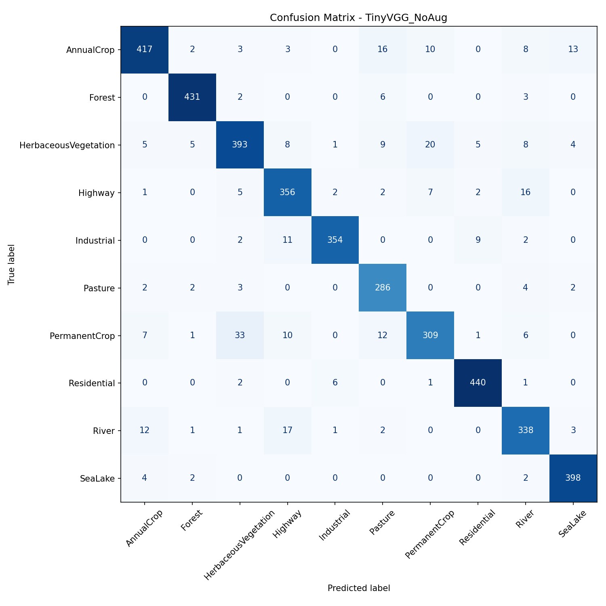

# Project Sentinel — Eyes of the Highway Reserve

Land-cover classification for a satellite feed monitoring the reserve-highway corridor. Two models are trained and compared, each with and without data augmentation, to figure out which setup is actually worth deploying on the pipeline.

## Dataset

EuroSAT (RGB, JPEG version) — 27,000 satellite images across 10 land-use classes: AnnualCrop, Forest, HerbaceousVegetation, Highway, Industrial, Pasture, PermanentCrop, Residential, River, SeaLake.

Split: 70% train (18,900), 15% validation (4,050), 15% test (4,050).

## Models

**1. TinyVGG (trained from scratch)**
A small custom CNN — three convolutional blocks (32 → 64 → 128 filters) with max-pooling, followed by a fully connected classifier head. Built to run on 64×64 inputs without needing a huge amount of compute.

**2. MobileNetV2 (transfer learning)**
Pretrained on ImageNet, backbone frozen, final classification layer swapped out and fine-tuned for the 10 EuroSAT classes. The idea was to treat it like retrofitting an off-the-shelf sensor onto the drone rather than building one from zero.

Both were trained for 10 epochs, batch size 64, Adam optimizer (lr = 0.001), on 64×64 images.

## Results

| Model | Augmentation | Test Accuracy |
|---|---|---|
| TinyVGG (scratch) | No | **93.90%** |
| TinyVGG (scratch) | Yes | 92.07% |
| MobileNetV2 (fine-tuned) | No | 85.95% |
| MobileNetV2 (fine-tuned) | Yes | 84.72% |

### Confusion Matrix — Best Model (TinyVGG, No Augmentation)



## Field Report

The from-scratch TinyVGG beat the pretrained MobileNetV2 by close to 8 points on this dataset. That's the opposite of what you'd expect walking in — pretrained models usually have an edge. The likely reason is domain mismatch: MobileNetV2's ImageNet weights are tuned for natural photos, full of everyday object textures and shapes taken at eye level. EuroSAT is top-down 64×64 satellite tiles, a completely different visual domain. Freezing the backbone meant the network never got the chance to adapt those features to what satellite imagery actually looks like, so a small CNN trained directly on the real data ended up doing better.

Augmentation (random flips and rotations) didn't help either model here — both versions with augmentation scored slightly lower than their plain counterparts. A couple of likely explanations: 10 epochs may not be enough training time to let the model benefit from the added variation, and satellite tiles are already fairly consistent in orientation and framing, so flips and rotations may be introducing noise rather than useful variety.

**Bottom line for deployment:** the scratch-trained TinyVGG without augmentation is the strongest candidate here, both in raw accuracy and in how cleanly its confusion matrix sits along the diagonal. If this were going into the actual reserve pipeline, that's the one I'd ship — with maybe more epochs and a broader augmentation sweep before ruling augmentation out for good.

## Files

- `Gen Ai task2.ipynb` — full notebook: data loading, both models, training, evaluation
- `requirements.txt` — dependencies
- `results_summary.csv` — accuracy table in CSV form
- `confusion_matrix_*.png` — confusion matrices for all four runs
- `curves_*.png` — loss/accuracy curves for all four runs

## How to Run

```
pip install -r requirements.txt
```

Open `Gen Ai task2.ipynb` in Jupyter or Colab (GPU recommended) and run all cells top to bottom. The notebook downloads the EuroSAT dataset via the Kaggle API, so you'll need a Kaggle account and API token set up first.
